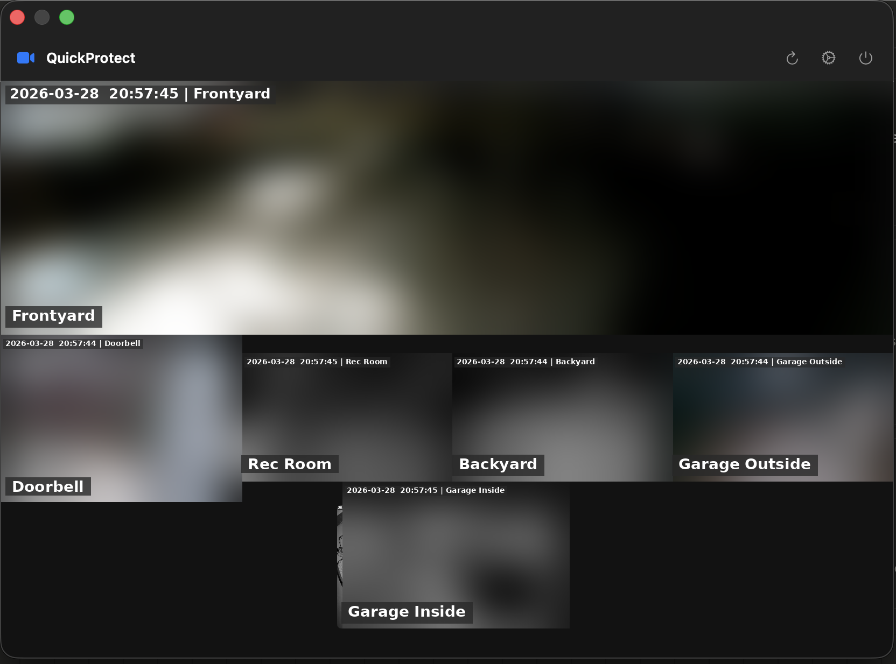

# QuickProtect

A lightweight macOS status bar app for viewing live camera feeds from a UniFi Protect controller.

Click the camera icon in your menu bar to instantly see all your cameras in a resizable popover — no browser or UniFi Protect app needed.



## Features

- **Live RTSP streaming** via a custom RTSP/RTP client built on Network.framework (no AVFoundation RTSP dependency)
- **H.265 (HEVC) and H.264** codec support, including multi-slice encoding (e.g. G4 Doorbell Pro)
- **Automatic aspect ratio detection** — wide cameras like the G6 180 display at their native ratio
- **Single-click focus** — click any camera to view it fullscreen within the popover
- **Display fullscreen** — press **F**, **Space**, or the expand button to fill your entire screen with a camera feed; press **F**, **Space**, or **Escape** to return
- **Zoom and pan** — pinch-to-zoom and two-finger pan on trackpad, scroll wheel zoom on mouse; pan is clamped to video edges
- **Double-click to open in Protect** — double-click any feed to jump straight to that camera in the UniFi Protect web UI
- **Resizable camera feeds** — right-click any camera to set Small / Medium / Large sizing
- **Drag-and-drop reordering** — arrange cameras however you want
- **Hide cameras** — hide feeds you don't need via right-click or Settings
- **Resizable popover** — drag to resize; size is saved per display
- **Per-display layouts** — different camera arrangements and popover sizes on your laptop vs. external monitor
- **Global keyboard shortcut** — toggle the popover from anywhere, configurable in Settings
- **Auto-update** — checks for updates on launch and daily; downloads, installs, and restarts automatically from GitHub releases
- **Launch at login** — optional, with a first-run prompt; toggle in Settings
- **Self-signed TLS support** — connects to controllers using self-signed certificates without system-wide trust changes
- **Closes on outside click** — click anywhere outside the popover to dismiss it

## Requirements

- macOS 13.0 or later (Apple Silicon)
- A UniFi Protect controller with the [Integration API](https://developers.ui.com/protect-api/) enabled
- An API key generated from the controller's settings

## Install

Download the latest DMG from [GitHub Releases](https://github.com/cb2206/QuickProtect/releases), open it, and drag QuickProtect to Applications.

## Setup

1. Click the camera icon in the menu bar
2. Click the gear icon to open **Settings**
3. Enter your controller's **IP address** and **API key**
4. Click **Test Connection** to verify
5. Close settings — your cameras will appear in the popover

## Keyboard Shortcuts

| Key | Context | Action |
|-----|---------|--------|
| **F** / **Space** | Popover focus | Toggle display fullscreen |
| **Escape** | Display fullscreen | Return to popover focus |
| **Escape** | Popover focus | Return to grid view |
| Custom shortcut | Anywhere | Toggle popover (configurable in Settings) |

## Building from Source

The project uses [XcodeGen](https://github.com/yonaskolb/xcodegen) to generate the Xcode project.

```bash
# Install XcodeGen (if needed)
brew install xcodegen

# Generate the Xcode project
xcodegen generate

# Open in Xcode
open QuickProtect.xcodeproj
```

Alternatively, compile directly with `swiftc`:

```bash
swiftc \
  -sdk $(xcrun --show-sdk-path) \
  -target arm64-apple-macos13.0 \
  -framework AppKit -framework SwiftUI -framework AVFoundation \
  -framework CoreMedia -framework Network -framework Security \
  -framework Combine -framework Carbon -framework ServiceManagement \
  -o QuickProtect \
  QuickProtect/*.swift \
  QuickProtect/**/*.swift
```

## Running Tests

```bash
# Via Xcode (requires Xcode.app)
xcodebuild test -project QuickProtect.xcodeproj -scheme QuickProtect -destination 'platform=macOS'

# Standalone (no Xcode needed)
swiftc -sdk $(xcrun --show-sdk-path) -target arm64-apple-macos13.0 -parse-as-library \
  -o /tmp/QuickProtectTests QuickProtect/Services/RTPParser.swift QuickProtectTests/TestRunner.swift \
  && /tmp/QuickProtectTests
```

61 tests cover RTP/RTSP parsing, H.264/H.265 NAL handling, AVCC conversion, SDP parsing, version comparison, grid layout, and hotkey management.

## Installing an Unsigned App

QuickProtect is not signed with an Apple Developer certificate. When you first open it, macOS will block it with a message like *"QuickProtect can't be opened because Apple cannot check it for malicious software."*

To allow it:

1. Open **System Settings** → **Privacy & Security**
2. Scroll down to the **Security** section
3. You'll see *"QuickProtect" was blocked to protect your Mac* with an **Open Anyway** button
4. Click **Open Anyway** and confirm

You only need to do this once. After that, QuickProtect will open normally.

## Remote Access

UniFi Protect does not expose public cloud APIs for video streaming. The official remote method (WebRTC via protect.ui.com) has no public API for third-party apps. This means QuickProtect requires network access to your controller's local IP.

To use QuickProtect when you're away from home, connect to your home network first using a VPN:

### Option 1: Tailscale (Recommended)

[Tailscale](https://tailscale.com/) is a zero-config WireGuard VPN that creates a private network between your devices.

1. Install Tailscale on your Mac and on a device on your home network (e.g., your UniFi gateway, a Raspberry Pi, or any always-on machine)
2. Enable [subnet routing](https://tailscale.com/kb/1019/subnets) to expose your home LAN (e.g., `10.0.1.0/24`)
3. Connect to Tailscale on your Mac — your controller's local IP is now reachable
4. QuickProtect works as if you were at home

### Option 2: UniFi Teleport

If you have a UniFi Gateway, [Teleport](https://help.ui.com/hc/en-us/articles/5246403561495-UniFi-Gateway-Teleport-VPN) is a built-in WireGuard VPN:

1. In the UniFi console, go to **Settings** → **Teleport & VPN** → **Teleport**
2. Generate an invitation link and open it on your Mac (via the [WiFiman](https://apps.apple.com/app/wifiman/id1385561119) app)
3. Once connected, your controller's local IP is reachable
4. QuickProtect works as if you were at home

### Other VPNs

Any VPN solution that gives you access to your home LAN will work — WireGuard, OpenVPN, ZeroTier, etc. Just ensure the controller's IP is routable through the VPN tunnel.

## How It Works

QuickProtect connects to your UniFi Protect controller using the Integration API (`/proxy/protect/integration/v1/`). It authenticates with an API key and creates on-demand RTSP sessions for each camera.

Since macOS 13+ dropped AVFoundation support for RTSP URLs, QuickProtect includes a custom RTSP/RTP client that:

1. Opens a TLS connection via `NWConnection` with per-connection certificate verification bypass
2. Runs the RTSP state machine (OPTIONS → DESCRIBE → SETUP → PLAY)
3. Parses RTP interleaved framing and reassembles H.264/H.265 NAL units
4. Groups NAL units into access units using the RTP marker bit (required for multi-slice cameras like the G4 Doorbell Pro)
5. Feeds AVCC-formatted data into `AVSampleBufferDisplayLayer` for hardware-accelerated decoding
6. All RTP processing runs on a dedicated serial queue (~18% CPU for 6 simultaneous streams, 0% when popover is closed)

## Support

If you find QuickProtect useful, consider buying me a coffee:

[](https://paypal.me/cb2206)

## License

MIT
