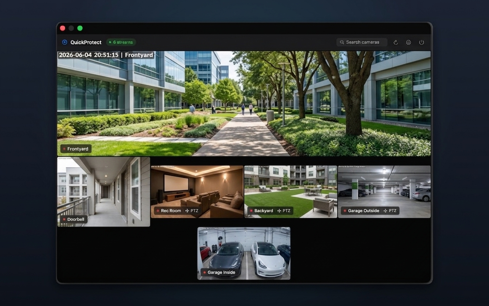
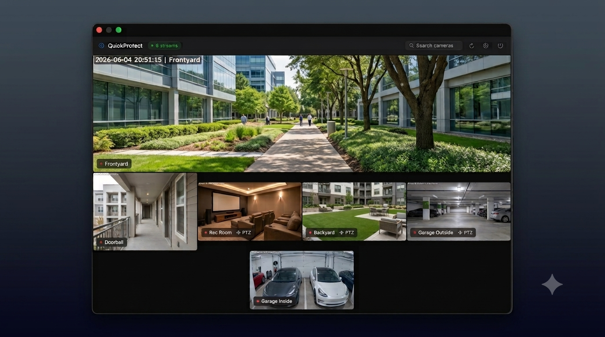

# QuickProtect

If you find QuickProtect useful, consider donating: [](https://paypal.me/cb2206)

A lightweight tray/menu-bar app for viewing live camera feeds from a UniFi Protect controller — no browser or UniFi Protect app needed.

<p>
  <a href="https://apps.apple.com/app/id6776899427"></a>
</p>

**Get QuickProtect**

- **macOS** — [Mac App Store](https://apps.apple.com/app/id6776899427) (signed, sandboxed, auto-updating) or the free unsigned DMG on [GitHub Releases](https://github.com/cb2206/QuickProtect/releases)
- **Windows** — Microsoft Store (signed, auto-updating) or the free unsigned installer on [GitHub Releases](https://github.com/cb2206/QuickProtect/releases)
- **Linux** — free self-contained x64 tarball on [GitHub Releases](https://github.com/cb2206/QuickProtect/releases) (AUR package `quickprotect-bin` coming)

<details name="screenshot" open>
<summary><strong>🖥 macOS</strong></summary>



</details>

<details name="screenshot">
<summary><strong>🪟 Windows</strong></summary>



</details>

## Features

- **Live camera grid** — every camera on your controller in a resizable panel, streamed over RTSP/RTSPS (H.264 and H.265)
- **Focus view** — click a camera for a single-feed view with fullscreen, fit/fill, mute, and snapshots
- **PTZ control** — pan, tilt, and zoom PTZ cameras with the keyboard or on-screen controls
- **Pinned windows** — float individual cameras in always-on-top windows
- **Layout profiles** — per-profile camera visibility, size, and order (per-display on macOS)
- **Global hotkey** — open the camera panel from anywhere
- **Secondary-lens picture-in-picture** — e.g. the package camera on doorbells
- **Self-signed TLS support** — trust-on-first-use certificate pinning, no system-wide trust changes; credentials live in the OS keychain/secure store
- **Multilingual** — English, German, French, Spanish, Dutch, Italian, and Brazilian Portuguese
- **Quality of life** — first-run onboarding, launch at login, notify-only update checks, light/dark theming and accent colors

The two implementations track each other feature-for-feature; the remaining platform differences are listed in [docs/PARITY.md](docs/PARITY.md).

## Repository layout

This repo hosts two independent implementations that share behavior, not code:

| Folder | What it is |
|---|---|
| [`macos/`](macos/) | The original macOS menu-bar app — Swift/SwiftUI/AppKit with a custom RTSP/RTP client. Ships on the [App Store](https://apps.apple.com/app/id6776899427) and as an unsigned DMG on [GitHub Releases](https://github.com/cb2206/QuickProtect/releases). |
| [`dotnet/`](dotnet/) | The Windows & Linux port — one .NET 8 + Avalonia codebase for both platforms, with a custom FFmpeg video engine. Ships on the Microsoft Store, as an unsigned installer on [GitHub Releases](https://github.com/cb2206/QuickProtect/releases), and (since 1.3.1) as a Linux x64 tarball on the same releases. |
| [`docs/`](docs/) | Cross-platform docs: [feature parity](docs/PARITY.md) between the two implementations, [privacy policy](docs/PRIVACY.md), App Store listings, screenshots. |
| [`scripts/`](scripts/) | Per-platform build & run entry points (see below). |

Each implementation has its own README with features, setup, and architecture details: [macOS](macos/README.md) · [Windows/Linux](dotnet/README.md).

## Build & run

Each platform has a `build` script (compile only) and a `run` script (compile, replace any running instance, launch):

```bash
# macOS (requires Xcode + XcodeGen)
scripts/macos/build.sh
scripts/macos/run.sh

# Linux (requires .NET 8 SDK; FFmpeg natives via dotnet/scripts/get-ffmpeg.sh)
scripts/linux/build.sh
scripts/linux/run.sh
```

```powershell
# Windows (requires .NET 8 SDK)
scripts\windows\build.ps1
scripts\windows\run.ps1
```

## License

Released under the [MIT License](LICENSE) — Copyright (c) 2026 Christian Bartels.
